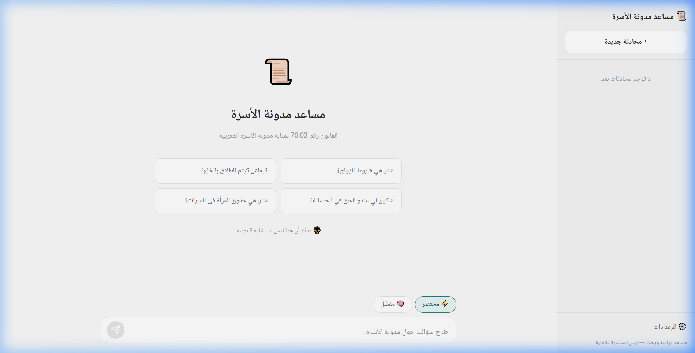

# 📜 مساعد مدونة الأسرة

مساعد دراسة وبحث في مدونة الأسرة المغربية (القانون رقم 70.03) — مبني بالذكاء الاصطناعي.

> **⚖️ هذا التطبيق مساعد دراسة وبحث فقط، وليس استشارة قانونية أو تمثيلًا قضائيًا.**



## ✨ المميزات

- 🤖 **ذكاء اصطناعي** — اسأل أي سؤال حول مدونة الأسرة واحصل على إجابة بالدارجة المغربية
- ⚡ **وضع مختصر** — جواب مباشر وقصير (2-5 جمل)
- 🧠 **وضع مفصّل** — تحليل شامل ومعمّق مع ذكر المواد
- 💬 **سجل المحادثات** — تحفظ تلقائيًا ويمكنك الرجوع إليها
- 📱 **تصميم متجاوب** — يعمل على الحاسوب والهاتف
- 🔒 **خصوصية** — مفتاح API يبقى عندك في المتصفح فقط

## 🚀 التشغيل

### متطلبات
- مفتاح [Gemini API](https://aistudio.google.com/apikey) مجاني (15 طلب/دقيقة)

### تشغيل محلي
```bash
npm install
npm run dev
```

### بناء للإنتاج
```bash
npm run build
```

## 🛠️ التقنيات

- **Vite** — أداة البناء
- **Gemini 2.5 Flash** — نموذج الذكاء الاصطناعي
- **Noto Naskh Arabic** — الخط العربي
- **GitHub Pages** — الاستضافة

## 📄 الرخصة

MIT
